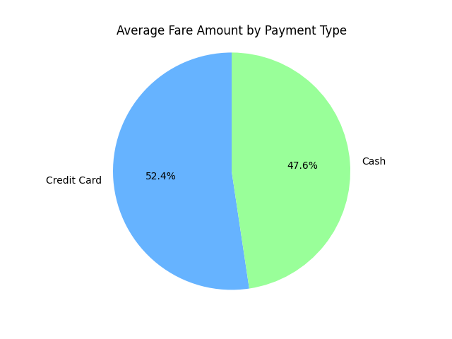

# NYC TLC: Statistical Analysis & A/B Testing

[⬅️ Back to NYC TLC 2017 Projects](../README.md)

## Executive Summary

### Key Insights
The primary objective of this phase was to determine if a relationship exists between payment type and fare amount. Statistical analysis through a two-sample t-test revealed a significant difference between payment methods. Specifically, credit card transactions resulted in higher average fare amounts compared to cash payments, suggesting that encouraging credit card usage could generate more revenue for the taxi industry.

### Details of the Visualization
* **Course_4_Pie_Chart.png:** This visualization compares the average fare amounts for the two primary payment methods, showing that credit card fares make up approximately 52.4% of the combined average, while cash accounts for 47.6%.
* **Statistical Verification:** The nearly 5% difference in averages was validated by a p-value of 6.79e-12, confirming that the revenue gap is not due to random sampling.

### Keys to Success
* **Hypothesis Testing Rigor:** A significance level of 5% was utilized to conduct a two-sample t-test, providing a mathematically sound basis for rejecting the null hypothesis.
* **Descriptive Baseline:** Computing descriptive statistics like mean, standard deviation, and quartile distributions allowed for an initial understanding of data patterns before moving to inferential testing.

### Next Steps
* **Causal Factor Study:** Investigate external factors beyond payment choice, such as trip distance or modern payment habits, that may influence why credit card users pay more.
* **Profitability Modeling:** Perform future modeling to quantify how much a shift toward credit card payments would increase overall industry profitability.

---

## Technologies & Tools
* **Language:** Python 3.x
* **Libraries:** Pandas, Scipy (stats module)
* **Visualization:** Matplotlib
* **Documentation:** Jupyter Notebook

---

## Project Files
* **[Course_4_Project.ipynb](Course_4_Project.ipynb):** The primary Python notebook containing the A/B testing logic and t-test calculations.
* **[Course_4_Project_PDF.pdf](Course_4_Project_PDF.pdf):** A static, readable export of the statistical analysis notebook.
* **[Course_4_Executive_Summary.pdf](Course_4_Executive_Summary.pdf):** A high-level report detailing the statistical findings and business recommendations.
* **[images/Course_4_Pie_Chart.png](images/Course_4_Pie_Chart.png):** Visualization of average fare differences between credit card and cash.

---

[⬅️ Back to NYC TLC 2017 Projects](../README.md)

