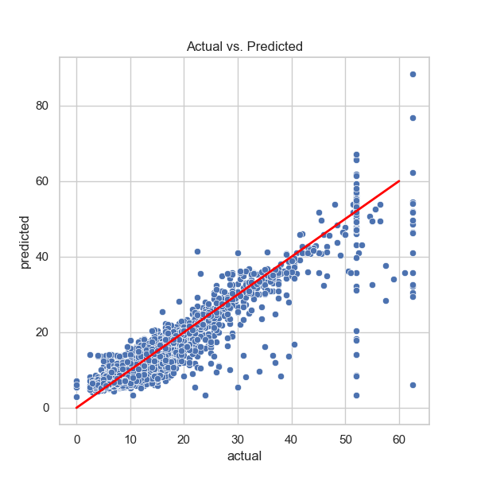

# NYC TLC: Multiple Linear Regression Modeling

[⬅️ Back to NYC TLC 2017 Projects](../README.md)

## Executive Summary

### Key Insights
The goal of this project phase was to build a multiple linear regression model to predict taxi fares using existing NYC TLC data. By analyzing relationships between a continuous dependent variable (fare amount) and several independent predictors, the model achieved a high level of predictive accuracy. Key drivers for fare amounts included trip duration and distance, which showed strong linear correlations with the target variable. The final model demonstrated an $R^2$ of approximately 0.868 on the test data, indicating it explains about 87% of the variance in taxi fares.

### Details of the Visualization
* **Actual vs. Predicted Scatter Plot:** The visualization displays a strong alignment between the model's predictions and the actual fare amounts, with data points clustering tightly around the $x=y$ line of best fit.
* **Residual Distribution:** A histogram of the residuals shows a normal distribution centered near zero, confirming that the model's errors are random and unbiased.
* **Feature Importance:** Coefficient analysis revealed that after unscaling the data, for every 1-mile increase in trip distance, the fare increased by a mean of approximately **$2.00**.

### Keys to Success
* **Rigorous Feature Engineering:** New variables were created, such as `mean_distance` and `mean_duration`, to capture geographic trends based on unique pickup and dropoff location pairs.
* **Outlier Imputation:** Extreme values in fare amounts and durations were addressed using an Interquartile Range (IQR) threshold ($Q3 + 6 \times IQR$) to prevent skewed results and improve model stability.
* **Standardization:** All features were scaled using `StandardScaler` to ensure that variables with different units were treated with equal mathematical weight during model training.

### Next Steps
* **Integration of Fixed Rates:** Future versions of the model can skip predictions for known flat-rate trips, such as the **$52** JFK airport rate, by directly imputing those values based on the `RatecodeID`.
* **Advanced Modeling:** Transition from linear regression to tree-based machine learning models (like Random Forest) to capture non-linear relationships and potentially improve predictive performance further.

---

## Technologies & Tools
* **Language:** Python 3.x
* **Libraries:** Scikit-learn, Pandas, NumPy, Matplotlib, Seaborn
* **Technique:** Multiple Linear Regression (OLS)
* **Documentation:** Jupyter Notebook

---

## Project Files
* **[Course_5_Project.ipynb](Course_5_Project.ipynb):** The primary Python notebook featuring data preprocessing, model fitting, and evaluation metrics.
* **[Course_5_Project_PDF.pdf](Course_5_Project_PDF.pdf):** A static version of the full regression analysis for easy technical review.
* **[Course_5_Executive_Summary.pdf](Course_5_Executive_Summary.pdf):** A professional summary designed for stakeholders at the NYC TLC.
* **[images/Course_5_Regression_Visual.png](images/Course_5_Regression_Visual.png):** Visualizations of residual plots and actual vs. predicted charts.
* **[images/Course_5_Correlation_Heatmap.png](images/Course_5_Correlation_Heatmap.png):** Correlation heatmap of fare amount, distance, rush hour, duration, vendor ID, and passenger count.
* 
---

[⬅️ Back to NYC TLC 2017 Projects](../README.md)

