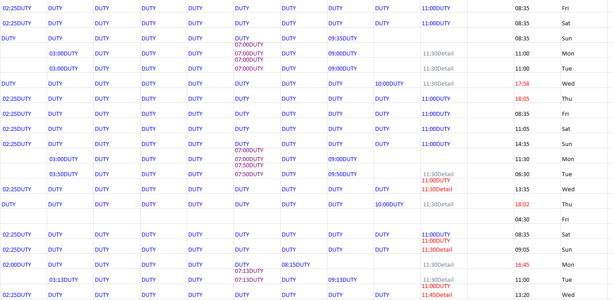

# 🕵️‍♂️ Payroll Fraud Detection & Audit Tool

## **Project Overview**
This tool was engineered to automate the forensic auditing of payroll datasets to identify shift overlaps, "Midnight Crossover" discrepancies, and compliance violations. By migrating from a manual review process to this automated C# engine, this program was pivotal in a Civic Oversight initiative to prevent wide-spread, systemic payroll fraud at a local police department.

[⬅️ Return to Main Portfolio](../README.md)

## **Key Forensic Logic**
The system processes raw Excel data through a custom **Temporal Attribution Engine** to map shifts into a 24-hour matrix:

* **Midnight Crossover Adjustment**: Automatically detects and links shifts spanning across two calendar days (e.g., 22:00 to 06:00) to ensure chronological continuity.
* **16.5-Hour Safety Guardrail**: Flags any single shift or combination of shifts exceeding the 16.5-hour safety limit in **RED** on the final dashboard.
* **Conflict Detection**: Utilizes logic-based auditing to identify "Primary Duty" and "Secondary Duty" overlaps occurring within the same hour in **RED**, flagging potential fraud for manual review.

## **Technical Stack**
* **Language**: C# (.NET Framework).
* **Data Ingestion**: OLEDB (JET 4.0) and SpreadsheetLight for high-fidelity Excel parsing.
* **Regex Engine**: Custom regular expressions for sanitizing "dirty" legacy system exports and identifying time-series patterns.
* **Reporting**: Automated generation of color-coded Excel dashboards with diagnostic audit logs.

## **Repository Structure**
* **[`/src`](./src/README.md)**: Contains `MainWindow.xaml.cs`, the functional forensic engine logic.
* **[`/test_material`](./test_material/README.md)**: Includes anonymized sample inputs and the resulting audit dashboard to demonstrate functional success, and an empty log file.
* **[`packages.config`](./packages.config)**: Manifest of NuGet dependencies (OpenXML, SpreadsheetLight).

## **How to Review Results**
Open the audit file [`test_material/COMBINE-ADP-DETAILS-ADP-2018.xslx`](./test_material/README.md) file to see the engine in action:
* **🔵 Blue**: Standard Primary Duty hours.
* **⚪ Gray**: Secondary Employment hours.
* **🔴 Red**: Overlap Conflict (Potential Fraud), two shifts in the same time block, or Safety Limit violation exceeding 16.5 hours in a 24-hour period.
* **🟣 Purple**: Primary employment entries cross-over, two duty shifts in the same time block to detect overtime padding.

[⬅️ Return to Main Portfolio](../README.md)

## Clip of Example Audit Spreadsheet

