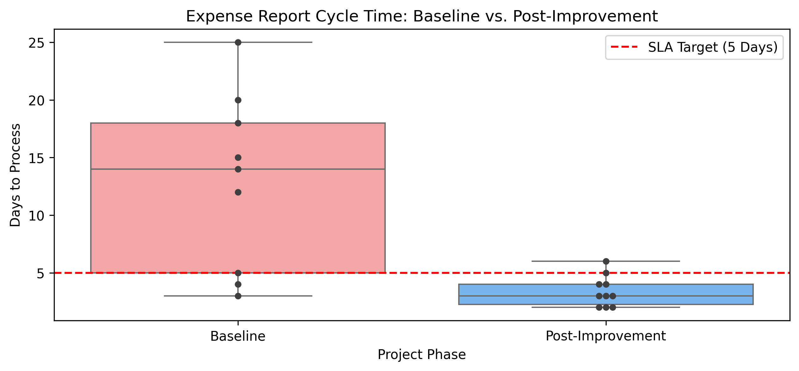

# 📉 Case Study: Expense Report Cycle Time Reduction
**Kennesaw State University | Six Sigma Green Belt Capstone**

### 📋 Executive Summary
This project optimized a corporate reimbursement process that was failing to meet its 5-day Service Level Agreement (SLA). As the **Project Team Lead**, I managed a cross-functional team to identify root causes for a 12-day average cycle time and implemented data-driven improvements.

*Figure 1: Statistical comparison of process cycle times before and after intervention.*

---

### 🔍 The Problem (Define & Measure)
* **Problem Statement**: The average cycle time for expense reports was 12 days, resulting in a 25% dissatisfaction rate and approximately $2,500 annually in late charges.
* **Baseline Metrics**: 
    * **Average Cycle Time**: 12.0 Days.
    * **Reprocessing Rate**: 60% of reports required corrections.
* **Goal**: Reduce the average cycle time to 5 days by March 13, 2026.

### 🔬 Statistical Analysis (Analyze)
Using **One-Way ANOVA**, I moved beyond intuition to statistically validate the root cause of delays:

* **Group A (Correct Reports)**: 4.0 Days average.
* **Group B (Defect Reports)**: 17.3 Days average.
* **P-Value**: < 0.001 (Confirming a statistically significant difference).
* **Pareto Analysis**: Revealed that **67% of defects** were caused by "Missing Receipts".
* **Root Cause**: The process relied on human vigilance rather than system controls (**Poka-Yoke**) to ensure data quality.

### 🛠️ Improvement & Control
* **Selected Solution**: Implemented a mandatory submission checklist and updated the Standard Operating Procedure (SOP).
* **Policy Update**: New rule mandates administrative rejection of reports without receipts within 24 hours.
* **Sustainability**: Established a weekly Control Plan to monitor reprocessing rates.

### 📊 Final Results (Simulated)
| Metric | Baseline | Goal | Result (March 2026) |
| :--- | :--- | :--- | :--- |
| **Avg Cycle Time** | 12.0 Days | 5.0 Days | **3.4 Days** |
| **Reprocessing Rate** | 60% | <10% | **10%** |

---

### 📂 Supporting Evidence
* **Jupyter Notebook**: [View Analysis Code](./Six_Sigma_Cycle_Time_Analysis.ipynb)
* **Jupyter Notebook (.PDF alternative)**: [View Analysis Code PDF](./docs/Six-Sigma-Green-Belt-Project-Jupyter-Notebook.pdf)
* **Full Project Charter**: [View PDF Report](./docs/Six-Sigma-Green-Belt-Project-Charter-Capstone-Project.pdf)
* **Methodology**: DMAIC (Define, Measure, Analyze, Improve, Control)

---
[⬅️ Return to Main Folder](../README.md)
